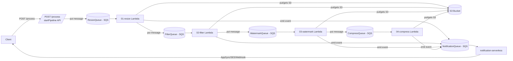

# Kiến trúc — Hệ thống Xử lý Ảnh Serverless & Notification (Cô đọng, A→Z)

Tài liệu này tập trung vào những điểm trọng tâm mà bạn cần trình bày: nhiệm vụ từng service, vai trò API Gateway, các pattern/công nghệ dùng + mục đích, hạn chế, lợi thế, đề xuất cải thiện và quy trình vận hành.

## Mục tiêu ngắn gọn
- Xử lý ảnh theo pipeline (resize → filter → watermark → compress) theo luồng bất đồng bộ.
- Dễ mở rộng, dễ debug (replay), chi phí tối ưu cho workload biến thiên.

## 1) Services & nhiệm vụ (rất cụ thể)

- `auth-frontend-next` (UI)
   - Nhiệm vụ: upload UI, hiển thị tiến trình, lấy presigned URL, subscribe AppSync.
   - Output: call `GET /presign`, subscribe GraphQL.

- `auth-service` (API layer / gateway)
   - Nhiệm vụ: xác thực/ủy quyền, cấp `presigned URL`, expose API: `POST /process`, `GET /jobs/:id`, quản lý rate-limit và CORS.
   - Ranh giới: không xử lý ảnh — chỉ orchestration & access control.

- `image-pipeline-app` (core pipeline)
   - Gồm Lambda functions: `00-start` (API), `01-resize`, `02-filter`, `03-watermark`, `04-compress`.
   - Mỗi function: nhận SQS message {jobId,imageId,s3Key,options}, đọc S3, xử lý, write S3 dưới `processed/{jobId}/<stage>.<ext>`, update metadata (DynamoDB), gửi message queue cho bước tiếp.

- `notification-serverless`
   - Gồm: SQS consumer, AppSync mutations (publishProgress), SES sender, DynamoDB tables:
      - `subscriptions` (userId, channels, destination, events)
      - `history` (eventId, jobId, userId, status, attempts, payload)
   - Nhiệm vụ: gửi realtime (AppSync), email (SES), webhook retry.

- Storage & infra
   - S3: buckets `inputs/` (gốc), `processed/{jobId}/` (intermediates + final).
   - SQS: queues per-stage (ResizeQueue, FilterQueue, WatermarkQueue, CompressQueue, NotificationQueue), each có DLQ.
   - DynamoDB: `ImageJobs` (metadata), `subscriptions`, `history`.

## 2) API Gateway / `auth-service` — nhiệm vụ chi tiết

- Xác thực & ủy quyền (JWT validation, role check).
- Tạo presigned URL với policy (prefix, ttl, content-type).
- Kiểm tra input (schema, MIME type patterns) trước khi tạo job.
- Throttling & rate-limiting (per-user or per-API-key).
- Audit logging (userId, IP, requestId) và trả về `jobId` ngay cho client.
- Orchestration entrypoint: `POST /process` chỉ tạo `job` và gửi message vào `ResizeQueue` — không chờ xử lý.

## 3) Patterns & công nghệ — cái nào dùng để làm gì (rõ ràng)

- Event-driven (SQS): decoupling, backpressure, replay. Mục đích: scale độc lập và chịu tải đột biến.
- Serverless Lambdas: nhanh deploy, trả phí theo dùng. Mục đích: tiết kiệm chi phí với workload biến thiên.
- S3 persistent artifacts: lưu intermediate để debug, replay, auditing.
- DynamoDB (metadata + conditional writes): trạng thái job, hỗ trợ optimistic locking → dùng cho idempotency/conditional updates.
- DLQ + retry policy: isolate poison messages và lưu để điều tra.
- Idempotency guards (check S3 output key + conditional DB update): tránh duplicate khi message delivered >1 lần.
- AppSync (GraphQL Subscriptions): push realtime cho client qua WebSocket.
- SES + webhook: thông báo email và callback cho external systems; retry exponential backoff.
- Image processing lib: `sharp` (Node) hoặc `libvips` (native via container). Mục đích: nhanh, low-memory.

## 4) Hạn chế cụ thể của hệ thống

- Chi phí I/O: mỗi bước đọc/ghi S3 nhiều lần → tăng S3 request và latency.
- At-least-once delivery (SQS): cần idempotency, nếu không sẽ có duplicates.
- Eventual consistency: metadata (DynamoDB) và artifacts có thể chưa đồng bộ nhất thời.
- Lambda cold-starts & runtime limits: bước nặng có thể bị timeout hoặc chậm.
- Operational overhead: nhiều queue/tables/roles cần giám sát và giữ cấu hình nhất quán.
- Throttling/quota của cloud (SQS, Lambda concurrency) cần điều chỉnh khi scale.

## 5) Lợi thế cụ thể của hệ thống

- Scale độc lập theo stage: tăng concurrency riêng cho `resize` hay `compress` khi cần.
- Chi phí hiệu quả cho workload theo mùa/biến thiên (serverless + S3).
- Dễ debug/replay: intermediate artifacts + structured events.
- Tăng tốc phát triển: thêm step mới chỉ cần function + queue.
- Decoupled notifications: người dùng/ứng dụng được push realtime mà không chặn pipeline.

## 6) Cải thiện (concrete) — ngắn / trung / dài hạn

- Ngắn hạn (1–4 tuần):
   - Thêm OpenTelemetry traceId xuyên suốt; bật structured logs + correlation id.
   - Alert: DLQ size > 0, step error rate > 1% trong 5 phút.
   - Kiểm toán số lần Put/Get S3; gộp nhỏ các write nếu có thể.

- Trung hạn (1–3 tháng):
   - Chuyển xử lý nặng (massive image / native libs) sang container workers (Fargate) để dùng `libvips` và giảm cold-start.
   - Thêm dedupe store (Redis/In-memory cache) cho idempotency nhanh.
   - Batch processing (gộp nhiều small images hoặc multi-size generation trong 1 pass).

- Dài hạn (>3 tháng):
   - Nếu throughput lớn: chuyển từ SQS → Kafka/Event Streaming cho retention và replay mạnh hơn.
   - Multi-region + CDN + origin failover cho latency toàn cầu.
   - ML-based adaptive compression/quality.

## 7) Quy trình vận hành & phát triển (rõ bước)

- CI/CD
   - PR → lint + unit tests → build artifacts per-function → deploy staging → run E2E smoke tests → canary deploy → promote.
   - IaC: Serverless Framework / Terraform quản lý queues, DLQ, IAM roles, AppSync schema.

- Incident runbook (ngắn):
   1. Kiểm tra DLQ size, logs có traceId sample.
   2. Lấy sample message từ DLQ → replay locally với localstack / minio.
   3. Nếu do dữ liệu xấu → mark job failed + notify user; nếu code → patch & redeploy, re-enqueue.

- Deployment
   - Canary worker change (10% traffic) → monitor errors/latency → 50% → 100%.

- Testing
   - Unit: utils image ops.
   - Integration: localstack + minio run full pipeline.
   - Contract: validate SQS message schema.
   - Golden image tests: pixel-compare for critical transforms.

## 8) Schemas (tối thiểu — copy/paste ready)

- Stage message (SQS):

```json
{ "jobId":"...", "imageId":"...", "userId":"...",
   "s3Bucket":"...", "s3Key":"inputs/..jpg",
   "options":{ "resize":{ "width":800,"height":600 }, "filter":{"type":"sepia"}},
   "traceId":"trx-...", "attempt":1 }
```

- Notification event (NotificationQueue):

```json
{ "eventId":"...","eventType":"image.resized","timestamp":"...",
   "source":"image-pipeline-app","data":{ "jobId":"...","imageId":"...","userId":"...","metadata":{}} }
```

- DynamoDB `subscriptions` minimal schema:
   - PK: `userId`, SK: `id` ; attrs: `channel` (email|webhook|appsync), `destination`, `events` (list), `isActive`.

## 9) Trả lời giáo viên — tóm tắt 30s / chi tiết 2 phút

- 30s: "Hệ thống là event-driven serverless pipeline: client upload → API tạo job → các Lambda stage liên kết qua SQS xử lý ảnh, intermediate lưu S3, notification push realtime bằng AppSync/SES." 
- 2 phút: nêu nhiệm vụ từng service, API Gateway chức năng security/orchestration, pattern chính (SQS decoupling, idempotency, DLQ), 2 lợi thế (scale & replay) và 2 hạn chế (I/O cost & eventual consistency), và roadmap (tracing + container workers).

---

File này hiện là bản cô đọng, cụ thể đủ để trình bày trước hội đồng. Muốn tôi: (1) viết bản tiếng Anh, (2) tạo slide 1 trang, hoặc (3) xuất Mermaid diagram sang PNG không? 

---

## 1. Kiến trúc tổng quan & Luồng hoạt động (End-to-End Flow)

Hệ thống hoạt động theo cơ chế **Event-Driven (Kiến trúc hướng sự kiện)** sử dụng **AWS SQS** làm Message Broker trung tâm và **AWS S3** làm Storage.



### Chi tiết luồng đi của ảnh (A - Z)

1. **Khởi động luồng (`00-start`)**: Khách hàng tải ảnh lên AWS S3 và gọi HTTP POST `/process` đến API Gateway của `startPipeline` Lambda.
2. Lambda này sẽ kiểm tra tính hợp lệ của dữ liệu đầu vào (MIME Type, cấu trúc S3 Key).
3. Nó sinh ra `jobId` và `imageId` duy nhất (dạng UUID) để theo dõi toàn bộ vòng đời xử lý.
4. Gửi tin nhắn chứa ngữ cảnh xử lý ban đầu vào **`ResizeQueue`** và gửi sự kiện bắt đầu (`image.processing.started`) vào **`NotificationQueue`**.
5. **Giai đoạn thay đổi kích thước (`01-resize`)**: Lambda `resize` được kích hoạt tự động bởi tin nhắn trong `ResizeQueue`.
6. Nó kiểm tra xem cấu hình yêu cầu có chứa tùy chọn `resize` (width, height) hay không. **Nếu không có**: Ghi log "skipped", bỏ qua xử lý, đẩy nguyên trạng tin nhắn sang `FilterQueue`.
7. **Nếu có**: Tải ảnh gốc từ S3 về thư mục `/tmp`, dùng thư viện `sharp` để resize, đẩy ảnh sau resize lên thư mục `processed/{jobId}/resize.[ext]` trên S3, cập nhật metadata mới và đẩy tin nhắn sang `FilterQueue`.
8. Gửi sự kiện cập nhật (`image.resized` hoặc `image.failed` nếu lỗi) vào **`NotificationQueue`**.
9. **Giai đoạn áp dụng bộ lọc (`02-filter`)**: Lambda `filter` được kích hoạt bởi tin nhắn trong `FilterQueue`.
10. Thực hiện tương tự: Tải ảnh từ bước trước đó trên S3, áp dụng bộ lọc ảnh (`grayscale`, `sepia`, `blur`, `brightness`) bằng `sharp`, đẩy ảnh sau xử lý lên S3 `processed/{jobId}/filter.[ext]`, đẩy tin nhắn sang `WatermarkQueue`.
11. Gửi sự kiện cập nhật (`image.filtered` hoặc `image.failed`) vào **`NotificationQueue`**.
12. **Giai đoạn chèn logo/chữ (`03-watermark`)**: Lambda `watermark` được kích hoạt bởi tin nhắn trong `WatermarkQueue`.
13. Tải ảnh từ S3. Nếu là watermark dạng ảnh, nó tải thêm ảnh logo từ S3 về để composite. Nếu là dạng chữ, tự động render SVG chữ đè lên góc ảnh theo cấu hình vị trí (`bottom-right`, `center`,...).
14. Đẩy ảnh sau xử lý lên S3 `processed/{jobId}/watermarked.[ext]`, chuyển tiếp tin nhắn sang `CompressQueue`.
15. Gửi sự kiện cập nhật (`image.watermarked` hoặc `image.failed`) vào **`NotificationQueue`**.
16. **Giai đoạn định dạng & nén cuối cùng (`04-compress`)**: Lambda `compress` được kích hoạt bởi tin nhắn trong `CompressQueue`.
17. Tải ảnh đã qua các bước xử lý trên S3.
18. Sử dụng `sharp` để đổi định dạng (JPEG, PNG, WebP) và tối ưu hóa dung lượng (nén chất lượng ảnh).
19. Ghi tệp hoàn chỉnh lên S3 `processed/{jobId}/final.[ext]`.
20. Gửi sự kiện kết thúc thành công (`image.completed` hoặc `image.failed`) kèm thông tin dung lượng, kích thước tệp cuối cùng vào **`NotificationQueue`**.
21. **Xử lý thông báo (`notification-serverless`)**: Lambda `sqsConsumer` được kích hoạt khi hàng đợi SQS `NotificationQueue` nhận sự kiện từ các bước trên.
22. Thực hiện gọi API AWS AppSync (GraphQL Mutation `publishProgress`) để đẩy dữ liệu thời gian thực cho Client WebSocket đang subscribe.
23. Truy vấn thông tin cấu hình từ DynamoDB Subscriptions Table để lọc các kênh liên hệ đã đăng ký (email/webhook) của user.
24. Tự động thực thi gửi Email thông báo (qua AWS SES) hoặc đẩy HTTP Webhook (kèm cơ chế thử lại lũy thừa) và lưu log vào DynamoDB History Table.

---

## 2. Cấu trúc dữ liệu sự kiện (Event Schema)

### A. Payload truyền tải giữa các Stage (SQS Message)

Đây là cấu trúc thông tin chạy xuyên suốt pipeline qua các queue:

```json
{
   "jobId": "f9b8c7a6-1234-5678-abcd-ef0123456789",
   "imageId": "a1b2c3d4-5678-90ab-cdef-1234567890ab",
   "userId": "user-999",
   "s3Bucket": "image-pipeline-bucket-dev-123456789",
   "s3Key": "processed/f9b8c7a6-1234-5678-abcd-ef0123456789/resize.png",
   "options": {
      "resize": { "width": 800, "height": 600, "fit": "cover" },
      "filter": { "type": "sepia" },
      "watermark": {
         "type": "text",
         "text": "Bản quyền 2026",
         "position": "bottom-right",
         "opacity": 0.6
      },
      "compression": { "format": "webp", "quality": 85 }
   },
   "metadata": {
      "width": 800,
      "height": 600,
      "format": "png",
      "size": 142058
   },
   "logs": [
      {
         "stage": "InputStage",
         "status": "completed",
         "message": "Pipeline initialized",
         "timestamp": "2026-05-27T00:30:00Z"
      },
      {
         "stage": "ResizeStage",
         "status": "completed",
         "message": "Successfully resized image to 800x600",
         "timestamp": "2026-05-27T00:30:15Z",
         "duration": 250
      }
   ]
}
```

Giải thích: payload này chứa `options` để các bước quyết định có thực hiện hay bỏ qua, `logs` cho trace nhẹ.

### B. Payload gửi đến Hàng đợi Thông báo (`NotificationQueue`)

Định dạng tương thích với thực thể `IEvent` trong `notification-service`:

```json
{
   "eventId": "e9c8b7a6-3210-4789-bcde-0123456789ab",
   "eventType": "image.resized",
   "timestamp": "2026-05-27T00:30:15.500Z",
   "source": "image-pipeline-app",
   "data": {
      "jobId": "f9b8c7a6-1234-5678-abcd-ef0123456789",
      "imageId": "a1b2c3d4-5678-90ab-cdef-1234567890ab",
      "userId": "user-999",
      "metadata": {
         "width": 800,
         "height": 600,
         "format": "png",
         "size": 142058
      }
   }
}
```

---

## 3. Quy trình Thiết lập & Triển khai nhanh

### Bước 1: Yêu cầu hệ thống

- Đã cài đặt Node.js 20+ và CLI Serverless (`npm install -g serverless@3`).
- Đã cấu hình CLI AWS có quyền truy cập đầy đủ S3, SQS, DynamoDB, AppSync và SES (`aws configure`).

### Bước 2: Triển khai Ứng dụng Xử lý Ảnh (`image-pipeline-app`)

1. Cài đặt các thư viện phụ thuộc cho từng Lambda Function:
```bash
cd image-pipeline-app
cd functions/00-start && npm install
cd ../01-resize && npm install --os=linux --cpu=x64 sharp
cd ../02-filter && npm install --os=linux --cpu=x64 sharp
cd ../03-watermark && npm install --os=linux --cpu=x64 sharp
cd ../04-compress && npm install --os=linux --cpu=x64 sharp
cd ../../
```

> NOTE: Cài đặt `sharp` bằng các cờ `--os=linux --cpu=x64` giúp mã nguồn chạy tốt khi đóng gói zip tải lên môi trường AWS Lambda Linux x64.
2. Triển khai tài nguyên lên AWS Cloud:
```bash
cd image-pipeline-app
serverless deploy --stage dev
cd ../
```
Lưu ý URL API Gateway trả về ở dòng Output (Ví dụ: `POST https://xxxx.execute-api.us-east-1.amazonaws.com/dev/process`).

### Bước 3: Triển khai Dịch vụ Thông báo (`notification-serverless`)

1. Cài đặt các plugin và thư viện phụ thuộc:
```bash
cd notification-serverless
serverless plugin install --name serverless-appsync-plugin

cd functions/sqs-consumer
npm install
cd ../../
```
2. Triển khai dịch vụ lên AWS:
```bash
cd notification-serverless
serverless deploy --stage dev
cd ../
```
Lưu ý ghi lại `GraphQLUrl` (AppSync Endpoint) và API Key trả về ở dòng Output.
3. Xác thực Email trên AWS SES: Nếu tài khoản AWS đang ở chế độ SES Sandbox, bạn cần vào AWS Console -> SES -> Verified Identities để đăng ký và xác thực email gửi (`noreply@example.com` hoặc cấu hình tùy chỉnh ở `emailFrom` trong `serverless.yml`) và email nhận thông báo thử nghiệm.

---

## 4. Kiểm thử tích hợp từ A - Z (End-to-End Test)

### Bước 1: Đăng ký nhận thông báo trong CSDL DynamoDB

Sử dụng AWS CLI để tạo subscription:
```bash
aws dynamodb put-item \
   --table-name notification-serverless-dev-subscriptions \
   --item '{
      "userId": {"S": "user-999"},
      "id": {"S": "sub-111"},
      "channel": {"S": "email"},
      "destination": {"S": "email_nhan_tin_nhan@example.com"},
      "events": {"L": [{"S": "image.completed"}, {"S": "image.failed"}]},
      "isActive": {"BOOL": true}
   }'
```

### Bước 2: Tải ảnh gốc lên S3

Tải một ảnh bất kỳ lên Bucket S3 được cấu hình bởi stack của bạn (ví dụ: tên bucket có dạng `image-pipeline-bucket-dev-`). Đặt tệp tại thư mục `inputs/nature.jpg`.

### Bước 3: Đăng ký lắng nghe tiến trình thời gian thực (GraphQL Subscription)

Sử dụng một client hỗ trợ GraphQL (như GraphQL Playground, Apollo Studio Sandbox hoặc Amplify) để đăng ký lắng nghe sự kiện thời gian thực bằng WebSocket sử dụng AppSync GraphQL URL và API Key nhận được ở Bước 3:

```graphql
subscription OnProgressUpdate {
   onProgressUpdate(userId: "user-999") {
      jobId
      imageId
      userId
      eventType
      status
      timestamp
      metadata
   }
}
```

### Bước 4: Kích hoạt Pipeline xử lý ảnh

Gửi yêu cầu xử lý ảnh thông qua API Gateway của `image-pipeline-app`:

```bash
curl -X POST https://xxxx.execute-api.us-east-1.amazonaws.com/dev/process \
   -H "Content-Type: application/json" \
   -d '{
      "userId": "user-999",
      "s3Key": "inputs/nature.jpg",
      "options": {
         "resize": { "width": 800, "height": 600, "fit": "cover" },
         "filter": { "type": "sepia" },
         "watermark": { "type": "text", "text": "Bản Quyền 2026", "position": "bottom-right" },
         "compression": { "format": "webp", "quality": 80 }
      }
   }'
```

### Bước 5: Kiểm tra kết quả

- **Real-time GraphQL Subscription**: Client của bạn sẽ lập tức nhận được các bản cập nhật WebSocket cho sự kiện từ `image.processing.started`, `image.resized`, `image.filtered`, `image.watermarked` cho đến `image.completed`.
- **Email thông báo**: Kiểm tra hòm thư của bạn để xác nhận email thông báo tự động từ AWS SES sau khi quá trình nén hoàn thành.
- **Dữ liệu S3**: Tệp tin kết quả `final.webp` và các tệp tin trung gian sẽ hiển thị đầy đủ trên AWS S3 tại thư mục `processed//`.
- **DynamoDB Logs**: Lịch sử gửi thông báo chi tiết được lưu trữ đầy đủ trong bảng `notification-serverless-dev-history`.


---

Muốn tôi thêm:
- Sơ đồ kiến trúc tổng (Mermaid) hoặc PNG xuất sẵn?
- Slide 1 trang tóm tắt (PDF/MD)?
- Phiên bản tiếng Anh cho báo cáo?

