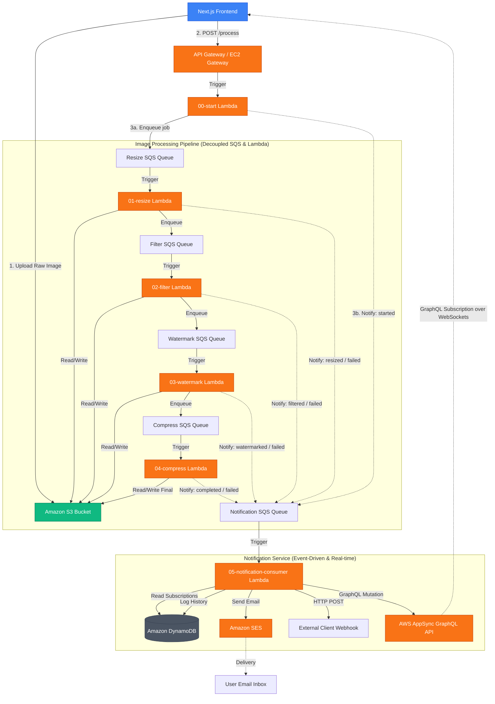
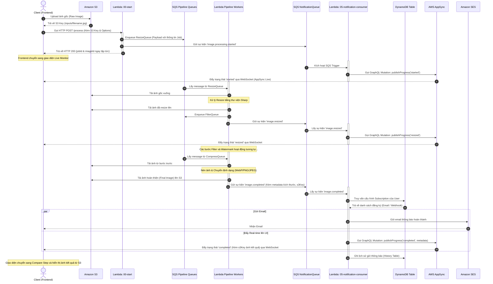

# Hệ thống Xử lý Ảnh & Thông báo Thời gian thực (Serverless Image Processing & Notification Architecture)

Tài liệu này mô tả chi tiết kiến trúc tổng thể, luồng truyền dữ liệu và mô hình giao tiếp giữa các thành phần trong hệ thống xử lý ảnh serverless và đẩy thông báo thời gian thực.

---

## 1. Sơ đồ Kiến trúc Tổng thể (System Architecture)

Dưới đây là mô hình hoạt động từ khi Client bắt đầu yêu cầu xử lý ảnh, qua các bước xử lý của đường ống (Pipeline), cho đến khi đẩy thông báo thời gian thực về giao diện qua AppSync WebSocket và gửi email/webhook.



---

## 2. Biểu đồ Luồng Tuần tự (Sequence Diagram)

Quy trình tuần tự của các thông điệp trao đổi giữa các Service khi xử lý một tác vụ:



---

## 3. Định dạng dữ liệu trao đổi (Data Schema)

### 3.1. Payload gửi giữa các bước xử lý ảnh (SQS Pipeline Message)

Đây là cấu trúc thông điệp được truyền nối tiếp qua các hàng đợi `ResizeQueue` $\rightarrow$ `FilterQueue` $\rightarrow$ `WatermarkQueue` $\rightarrow$ `CompressQueue`:

```json
{
  "jobId": "f784e1b8-27b0-4467-bc85-a7c1b52a9261",
  "imageId": "6c49e29a-2411-4091-893f-c967406b3a0e",
  "userId": "user-999",
  "s3Bucket": "image-pipeline-bucket-prod-108836621838",
  "s3Key": "processed/f784e1b8-27b0-4467-bc85-a7c1b52a9261/resize.jpg",
  "options": {
    "resize": { "width": 800, "height": 600, "fit": "cover" },
    "filter": { "type": "sepia", "value": 1.3 },
    "watermark": {
      "type": "text",
      "text": "Copyright 2026",
      "position": "bottom-right",
      "opacity": 0.6
    },
    "compression": { "format": "webp", "quality": 85 }
  },
  "metadata": {
    "width": 1920,
    "height": 1080,
    "format": "jpeg",
    "size": 1048576
  },
  "logs": [
    {
      "stage": "InputStage",
      "status": "completed",
      "message": "Pipeline initialized",
      "timestamp": "2026-05-28T14:40:00.000Z"
    },
    {
      "stage": "ResizeStage",
      "status": "completed",
      "message": "Successfully resized image to 800x600",
      "timestamp": "2026-05-28T14:40:02.000Z",
      "duration": 450
    }
  ]
}
```

### 3.2. Payload gửi tới hàng đợi thông báo (SQS Notification Event)

Các hàm xử lý gửi thông điệp trạng thái này vào `NotificationQueue` sau mỗi bước xử lý:

```json
{
  "eventId": "90ba95ef-cc6c-48c6-b3de-cc86c26bbefb",
  "eventType": "image.completed",
  "timestamp": "2026-05-28T14:40:08.500Z",
  "source": "image-pipeline-app",
  "data": {
    "jobId": "f784e1b8-27b0-4467-bc85-a7c1b52a9261",
    "imageId": "6c49e29a-2411-4091-893f-c967406b3a0e",
    "userId": "user-999",
    "metadata": {
      "s3Key": "processed/f784e1b8-27b0-4467-bc85-a7c1b52a9261/final.webp",
      "width": 800,
      "height": 600,
      "format": "webp",
      "size": 108200
    }
  }
}
```

---

## 4. Các điểm kết nối chính và Giao thức (Key Integration Points)

1. **API Gateway (HTTP POST):** Cung cấp API không đồng bộ công khai để tiếp nhận file yêu cầu xử lý từ Client. Trả về `jobId` ngay lập tức để Client không cần chờ xử lý đồng bộ dài dòng.
2. **AWS SQS Queues:** Đóng vai trò là bộ đệm (message broker) tin cậy giữa các khâu xử lý ảnh, giúp hệ thống có khả năng tự động điều chỉnh tải (Auto-scaling), chống mất mát tác vụ và xử lý cô lập lỗi khi có sự cố tại một Lambda.
3. **DynamoDB Tables:**
   - `subscriptions`: Chứa cấu hình đăng ký thông báo qua Email/Webhook của người dùng.
   - `history`: Nhật ký lưu trữ kết quả và trạng thái gửi thông báo (phục vụ giám sát lỗi và cơ chế thử lại - retry).
4. **AWS AppSync (GraphQL over WebSockets):** Hỗ trợ đẩy thông báo đẩy tiến trình xử lý trực tiếp xuống Frontend. Sử dụng cấu hình xác thực qua `API_KEY` của AppSync để đảm bảo bảo mật kết nối WebSocket.
5. **Amazon SES (SMTP/SES Client):** Hệ thống chuyển tiếp email bảo mật để gửi báo cáo trạng thái hoàn thành kèm các số liệu về tỷ lệ nén ảnh cho người dùng.
