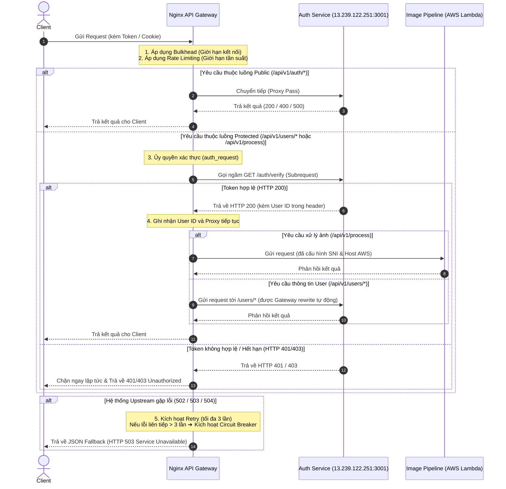

# 🌐 Nginx API Gateway - Resilience & Centralized Authentication

Dự án này chứa cấu hình **Nginx API Gateway** đóng vai trò là chốt chặn bảo mật, quản lý lưu lượng (Traffic Management), ủy quyền xác thực (Centralized Authentication) và đảm bảo tính sẵn sàng cao (Resilience) cho toàn bộ hệ thống xử lý ảnh **ImageProcessing**.

---

## 🗺️ Kiến trúc Hệ thống & Luồng xử lý (Architecture & Message Flow)

Khi client gửi một request tới Gateway, Nginx sẽ áp dụng các cơ chế kiểm soát chất lượng dịch vụ theo sơ đồ dưới đây trước khi chuyển tiếp (Proxy) tới các dịch vụ phía sau:



---

## 🛡️ Chi tiết các Cơ chế Resilience & Fault Tolerance

Để bảo vệ các dịch vụ phía sau (Downstream Services) khỏi bị quá tải, sập dây chuyền (Cascading Failures) hoặc bị tấn công từ chối dịch vụ (DDoS/Spam), Gateway tích hợp 4 mô hình phục hồi bền bỉ:

### 1. Giới hạn Tần suất (Rate Limiting)
*   **Nguyên lý**: Sử dụng thuật toán **Leaky Bucket** để làm mịn lưu lượng truy cập đột biến.
*   **Cấu hình chi tiết**:
    *   `limit_req_zone $binary_remote_addr zone=api_rate_limit:10m rate=10r/s;`
        *   Sử dụng địa chỉ IP của client (đã được tối ưu dung lượng dạng binary - 4 bytes cho IPv4) làm khóa định danh.
        *   Cấp phát vùng nhớ `10MB` (lưu trữ được thông tin của khoảng 160,000 IP duy nhất).
        *   Tần suất giới hạn là **10 requests / giây (10r/s)** cho mỗi IP.
    *   `limit_req zone=api_rate_limit burst=20 nodelay;`
        *   Cho phép lưu lượng tăng đột biến tích lũy tối đa **20 requests (burst)** vào hàng đợi.
        *   Tham số `nodelay` giúp xử lý các request này ngay lập tức mà không giữ lại gây tăng latency, nhưng các request vượt quá 20 trong hàng đợi sẽ lập tức bị từ chối.
    *   `limit_req_status 429;`: Trả về mã lỗi HTTP chuẩn **429 (Too Many Requests)** thay vì mã 503 mặc định.

### 2. Cách ly tài nguyên kết nối (Bulkhead / Connection Limiting)
*   **Nguyên lý**: Giới hạn số lượng kết nối TCP đồng thời nhằm ngăn chặn hiện tượng một IP client hoặc một server bị lỗi chiếm dụng toàn bộ Connection Pool của hệ thống.
*   **Cấu hình chi tiết**:
    *   `limit_conn ip_bulkhead 10;`: Giới hạn tối đa **10 kết nối đồng thời** từ cùng một địa chỉ IP client.
    *   `limit_conn server_bulkhead 200;`: Giới hạn tối đa **200 kết nối đồng thời** trên toàn bộ API Gateway để đảm bảo hệ thống không bị quá tải CPU/RAM.
    *   `limit_conn_status 429;`: Trả về mã lỗi HTTP 429 khi vượt ngưỡng kết nối đồng thời.

### 3. Ngắt mạch tự động (Circuit Breaker)
*   **Nguyên lý**: Theo dõi sức khỏe của các Server Upstream. Nếu tỷ lệ lỗi vượt quá ngưỡng cấu hình, hệ thống sẽ tự động ngắt kết nối tạm thời tới server đó và chuyển hướng sang fallback ngay lập tức mà không phải chờ đợi timeout lâu.
*   **Cấu hình chi tiết**:
    *   `server 13.239.122.251:3001 max_fails=3 fail_timeout=15s;`
    *   Trong khoảng thời gian `15 giây` (`fail_timeout`), nếu Nginx gửi request tới Upstream này mà bị thất bại liên tiếp `3 lần` (`max_fails`), Nginx sẽ đánh dấu server này là **offline (ngắt mạch)** trong vòng 15 giây tiếp theo.
    *   Mọi request đến trong thời gian ngắt mạch sẽ không được gửi tới Upstream mà sẽ lập tức trả về mã lỗi hoặc định tuyến sang server backup/fallback.

### 4. Thử lại tự động (Retry Mechanism)
*   **Nguyên lý**: Khi một request gửi tới Upstream gặp sự cố mạng tạm thời, Gateway tự động thử lại trên các node khác (hoặc gửi lại) trước khi báo lỗi về cho client.
*   **Cấu hình chi tiết**:
    *   `proxy_next_upstream error timeout http_502 http_503 http_504;`: Chỉ thực hiện thử lại khi gặp các lỗi mất kết nối, timeout hoặc lỗi hệ thống từ phía server.
    *   `proxy_next_upstream_tries 3;`: Số lần thử lại tối đa là **3 lần**.
    *   `proxy_next_upstream_timeout 5s;` (và 8s cho luồng xử lý ảnh): Thời gian tối đa dành cho toàn bộ quá trình thử lại.

---

## 🔑 Cơ chế Xác thực Tập trung (Centralized Authentication - `auth_request`)

Gateway sử dụng module `ngx_http_auth_request_module` của Nginx để thực thi kiểm tra quyền truy cập một cách tập trung, giúp giảm tải việc lặp lại logic xác thực JWT ở các microservice phía sau:

1.  **Đăng ký Route nội bộ (`/internal-auth-verify`)**:
    *   Cấu hình cờ `internal;` để đảm bảo client bên ngoài không thể trực tiếp gọi hoặc scan trúng endpoint này.
    *   Thiết lập `proxy_pass_request_body off;` và `proxy_set_header Content-Length "";` nhằm **bỏ qua request body** khi gọi sang `auth-service`. Do Nginx chỉ cần gửi Token/Cookie để check tính hợp lệ, việc lược bỏ body giúp giảm băng thông mạng nội bộ đáng kể.
    *   Chuyển tiếp `Authorization` header và `Cookie` đầy đủ từ request gốc.
2.  **Tách biệt Luồng công khai & Bảo mật**:
    *   **Luồng Công khai (`/api/v1/auth/*`)**: Trỏ trực tiếp tới `auth-service/auth/*` (như đăng nhập, đăng ký, refresh token, login mạng xã hội).
    *   **Luồng Bảo vệ (`/api/v1/users/*` và `/api/v1/process`)**: Thiết lập directive `auth_request /internal-auth-verify;`. Nginx sẽ chặn request lại, gọi ngầm API xác thực. Chỉ khi nhận về HTTP **200 OK**, Nginx mới cho phép request gốc tiếp tục đi tiếp vào các service thực tế.
3.  **Truyền dẫn dữ liệu User (Header Propagation)**:
    *   Sau khi xác thực thành công, Nginx có thể lấy dữ liệu phản hồi từ `auth-service` (ví dụ thông tin User ID) và đính kèm vào header chuyển tiếp tới microservice đích qua thiết lập:
        `auth_request_set $user_id $upstream_http_x_user_id;`
        `proxy_set_header X-User-Id $user_id;`

---

## ☁️ Cấu hình Tương thích AWS Serverless (TLS/SNI)

Khi proxy tới API Gateway của AWS Lambda (`3m34ux39q0.execute-api.us-east-1.amazonaws.com`), Nginx bắt buộc phải giải quyết giao thức bắt tay TLS bằng cách ghi đè thông tin định danh:
```nginx
proxy_set_header Host 3m34ux39q0.execute-api.us-east-1.amazonaws.com;
proxy_ssl_server_name on;
proxy_ssl_protocols TLSv1.2 TLSv1.3;
```
*   `proxy_set_header Host`: Bắt buộc phải trùng khớp với domain đích của AWS CloudFront/API Gateway để máy chủ AWS định tuyến chính xác.
*   `proxy_ssl_server_name on;` (SNI): Gửi kèm tên miền đích trong quá trình khởi tạo kết nối SSL nhằm đảm bảo bắt tay chứng chỉ HTTPS thành công mà không gặp lỗi `403 Forbidden` hoặc lỗi không khớp chứng chỉ.

---

## 🌀 Phản hồi Lỗi Tùy chỉnh (Custom Fallback JSON Response)

Khi xảy ra lỗi hệ thống nặng hoặc kích hoạt Circuit Breaker, Nginx sẽ tự động chặn mã lỗi và trả về một định dạng JSON sạch đẹp, đồng bộ với chuẩn API hiện đại thay vì trả về giao diện HTML mặc định của Nginx:

```json
{
  "status": "error",
  "code": 503,
  "message": "Service temporarily unavailable. Circuit breaker triggered or backend offline."
}
```

Cấu hình thực thi thông qua block:
```nginx
error_page 502 503 504 = @fallback;
location @fallback {
    return 503 '{"status":"error","code":503,"message":"Service temporarily unavailable. Circuit breaker triggered or backend offline."}';
    add_header Content-Type application/json;
    add_header Access-Control-Allow-Origin *;
}
```

---

## 🚀 Hướng dẫn Triển khai bằng Docker

Tệp `DockerFile` đi kèm trong thư mục đã được tối ưu hóa bằng cách sử dụng phiên bản **Nginx Alpine** siêu nhẹ (chỉ khoảng chục MB).

### 1. Build Docker Image
Chạy lệnh sau tại thư mục `api-gateway`:
```bash
docker build -t image-processing-gateway .
```

### 2. Chạy Container
```bash
docker run -d \
  -p 80:80 \
  --name ip-gateway \
  --restart unless-stopped \
  image-processing-gateway
```
*(Nếu triển khai bằng docker-compose, chỉ cần chạy lệnh `docker-compose up -d --build`)*

---

## 🔬 Hướng dẫn Kiểm thử Xác minh (Verification Guide)

Dưới đây là một số lệnh `curl` mẫu giúp bạn chạy kiểm thử nhanh các cơ chế của Gateway:

1.  **Kiểm tra endpoint public (không cần token)**:
    ```bash
    curl -i -X POST http://localhost/api/v1/auth/login \
      -H "Content-Type: application/json" \
      -d '{"email":"your_email@example.com","password":"your_password"}'
    ```
    *Mong muốn*: Đi thẳng vào `auth-service` thành công.
2.  **Kiểm tra chặn truy cập khi thiếu Token**:
    ```bash
    curl -i -X GET http://localhost/api/v1/users/
    ```
    *Mong muốn*: Trả về `401 Unauthorized` trực tiếp từ Nginx.
3.  **Kiểm tra hoạt động bình thường khi có Token hợp lệ**:
    ```bash
    curl -i -X GET http://localhost/api/v1/users/ \
      -H "Authorization: Bearer <ACCESS_TOKEN>"
    ```
    *Mong muốn*: Nhận về HTTP `200 OK` kèm danh sách user từ database.
4.  **Kiểm tra tính năng Rate Limiting**:
    Gửi liên tiếp 20 request trong 1 giây bằng lệnh loop:
    ```bash
    for i in {1..20}; do curl -s -o /dev/null -w "%{http_code}\n" http://localhost/health; done
    ```
    *Mong muốn*: Các request đầu tiên trả về `200`, các request tiếp theo vượt ngưỡng 10r/s sẽ nhận ngay mã lỗi `429`.
5.  **Kiểm tra Circuit Breaker & Fallback**:
    Tắt dịch vụ `auth-service` (hoặc cấu hình sai IP Upstream để mô phỏng sự cố sập server), sau đó truy cập lại:
    ```bash
    curl -i -X GET http://localhost/api/v1/users/ -H "Authorization: Bearer <ANY_TOKEN>"
    ```
    *Mong muốn*: Sau tối đa 3 lần thử thất bại, Nginx sẽ kích hoạt mạch ngắt và lập tức trả về chuỗi JSON thông báo lỗi 503 custom từ `@fallback` mà không cần tốn thời gian chờ timeout nữa.
