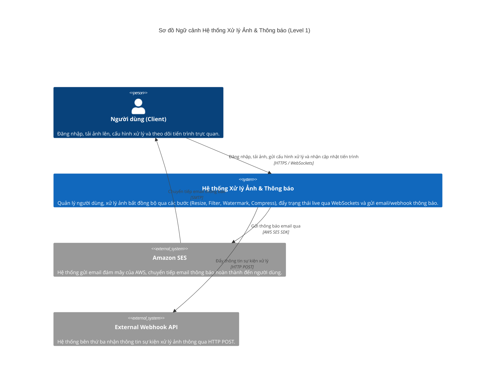
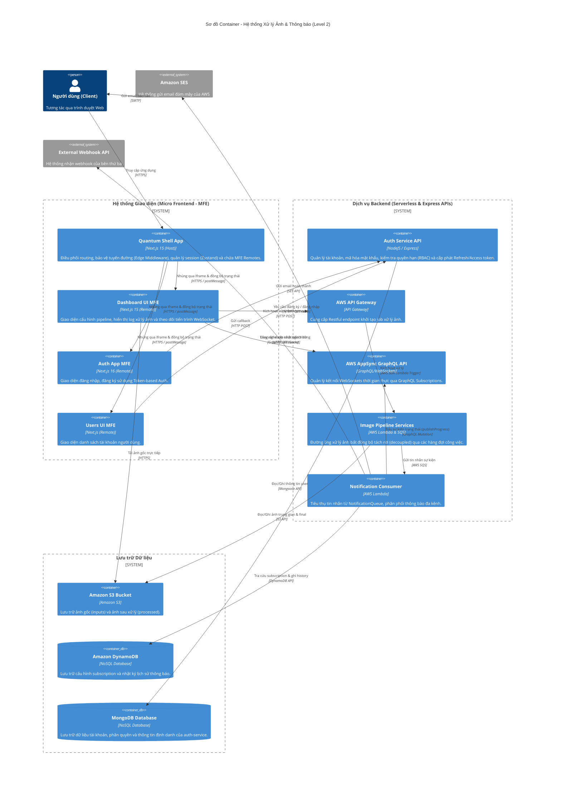
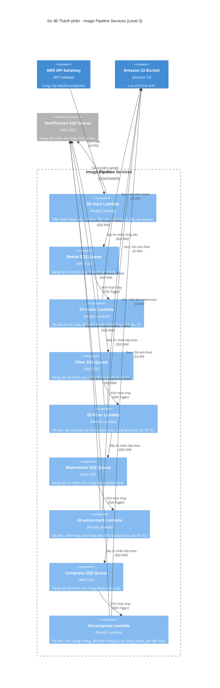
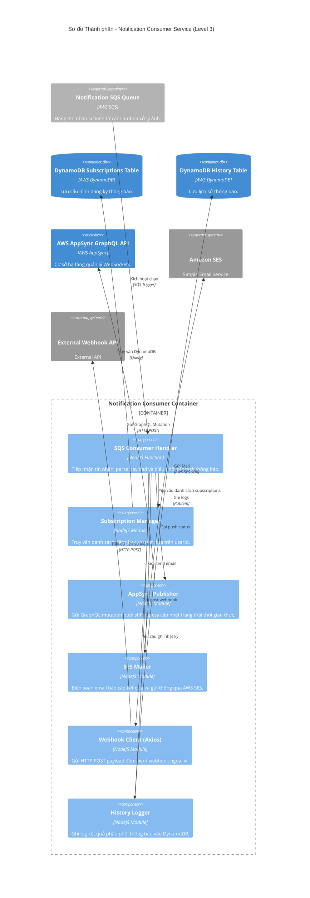
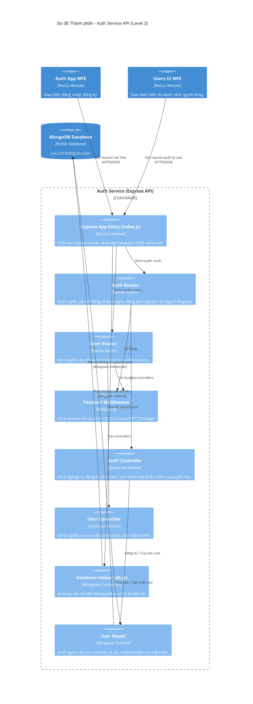

# Sơ đồ C4 Model - Hệ thống Xử lý Ảnh & Thông báo Serverless

Tài liệu này mô tả kiến trúc hệ thống xử lý ảnh và thông báo thời gian thực thông qua 3 cấp độ (Level) của mô hình C4 Model sử dụng cú pháp chuẩn của **Mermaid C4 Diagram** (C4Context, C4Container, C4Component), được đối chiếu chính xác với mã nguồn thực tế của dự án.

---

## 1. Level 1: Sơ đồ ngữ cảnh hệ thống (System Context Diagram)

Sơ đồ này biểu diễn ranh giới của toàn bộ hệ thống, các tác nhân bên ngoài (Người dùng) và các hệ thống liên kết ngoại vi sử dụng `C4Context`.

---

## 2. Level 2: Sơ đồ Container (Container Diagram)

Sơ đồ này phân rã hệ thống thành các Container chạy độc lập dựa trên cấu trúc thư mục thực tế của dự án:
- **Frontend MFE**: `shell-app` (cổng 3000), `auth-frontend-next` (`auth-app` cổng 3001), `dashboard-ui` (cổng 3002), và `user-ui` (cổng 3003).
- **Backend Services**: `auth-service` (Express API cổng 3000) và các Serverless AWS Services (`image-pipeline-app` & `notification-serverless`).
- **Storage**: Amazon S3, Amazon DynamoDB, và MongoDB.

---

## 3. Level 3: Sơ đồ Thành phần (Component Diagram)

Dưới đây là sơ đồ thành phần chi tiết của các container backend cốt lõi: **Image Pipeline Services**, **Notification Consumer**, và **Auth Service API**.

### 3.1. Thành phần của Image Pipeline Services

Sơ đồ thể hiện luồng xử lý và cách thức các Lambda function liên kết tuần tự qua hàng đợi SQS.

### 3.2. Thành phần của Notification Consumer

Sơ đồ mô tả luồng logic bên trong của Consumer Lambda dùng để định tuyến thông báo đến các kênh.

### 3.3. Thành phần của Auth Service API

Sơ đồ mô tả cấu trúc MVC bên trong của dịch vụ Express quản lý xác thực và thông tin người dùng.

