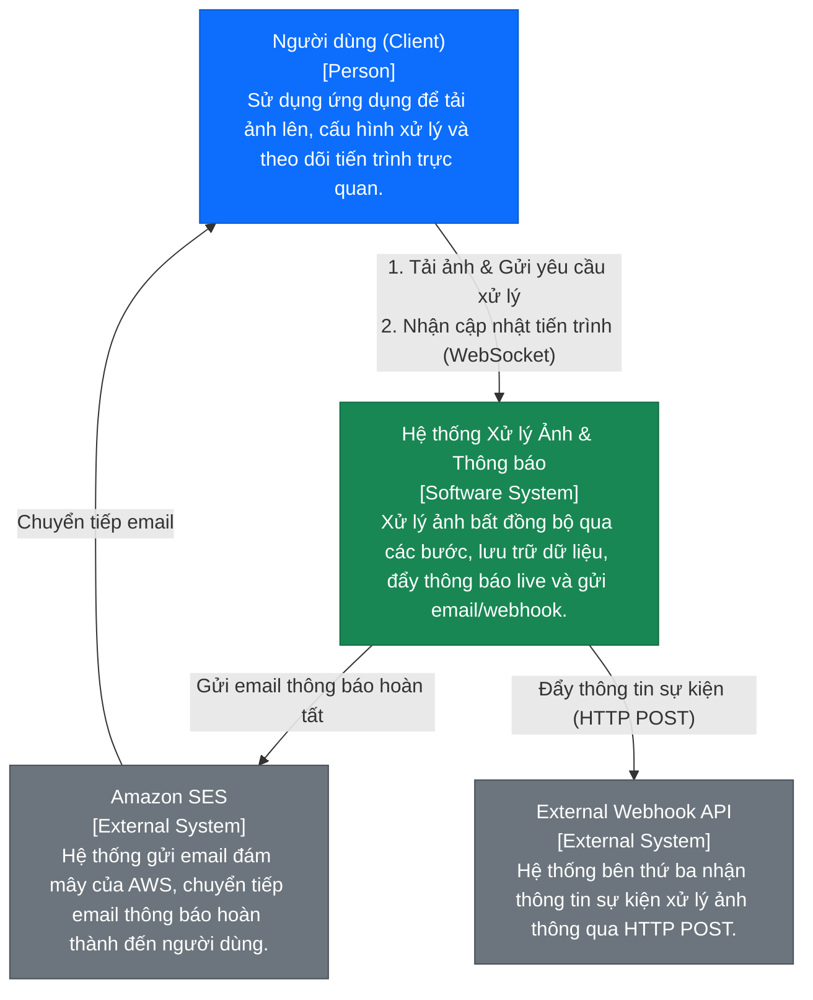
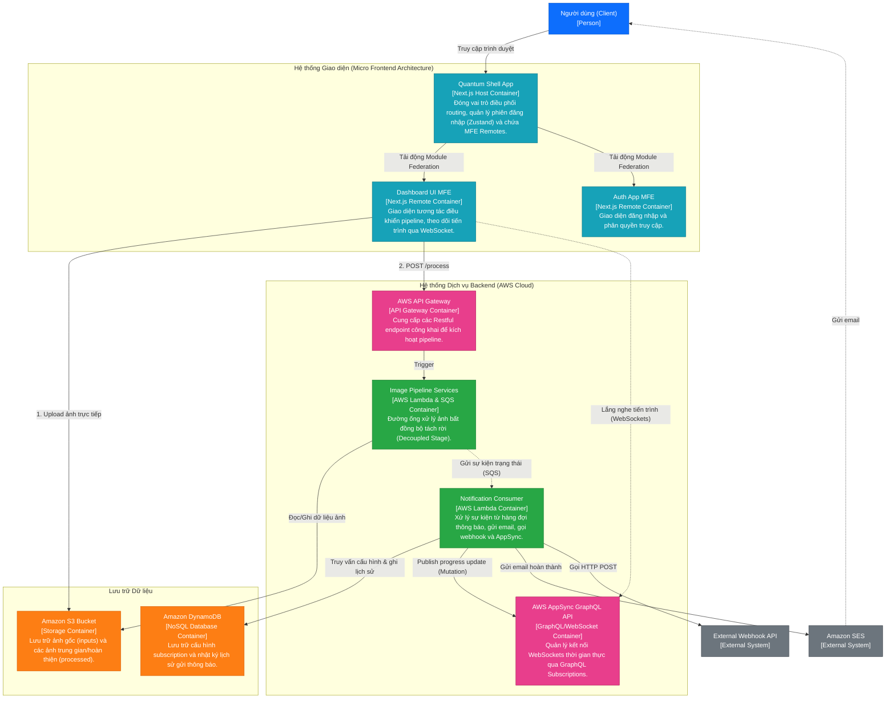
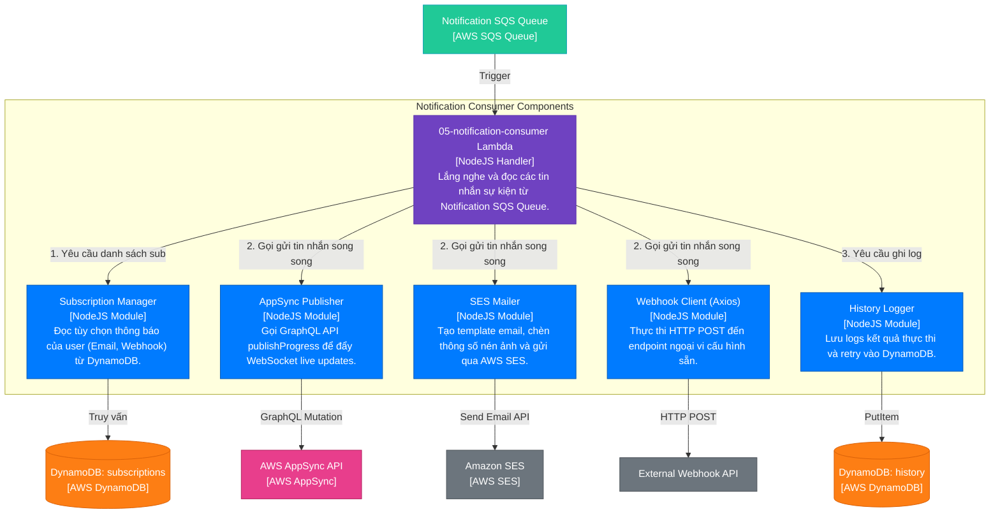

# Sơ đồ C4 Model - Hệ thống Xử lý Ảnh & Thông báo Serverless

Tài liệu này mô tả kiến trúc hệ thống xử lý ảnh và thông báo thời gian thực thông qua 3 cấp độ (Level) của mô hình C4 Model sử dụng Mermaid.js.

---

## 1. Level 1: Sơ đồ ngữ cảnh hệ thống (System Context Diagram)

Sơ đồ này biểu diễn ranh giới của hệ thống, các tác nhân bên ngoài (Người dùng) và các hệ thống liên kết ngoại vi.

---

## 2. Level 2: Sơ đồ Container (Container Diagram)

Sơ đồ này phân rã Hệ thống Xử lý Ảnh & Thông báo thành các container công nghệ (ứng dụng chạy độc lập, database, storage) và sự tương tác giữa chúng.

---

## 3. Level 3: Sơ sơ đồ Thành phần (Component Diagram)

Ở cấp độ này, chúng ta đi sâu vào cấu trúc bên trong của hai container backend quan trọng: **Image Pipeline Services** và **Notification Consumer**.

### 3.1. Thành phần của Image Pipeline Services

Sơ đồ thể hiện cách các hàng đợi AWS SQS (Message Broker) kết nối các AWS Lambda độc lập xử lý hình ảnh.

```mermaid
graph LR
    %% API Gateway trigger
    API["AWS API Gateway"]
    S3["Amazon S3 Bucket"]

    subgraph PipelineComp ["Image Pipeline Components"]
        StartFn["00-start Lambda<br>[NodeJS Component]<br>Nhận tham số, validate, cấp Job ID, ghi logs."]
        
        ResizeQ["Resize SQS Queue<br>[AWS SQS Queue]"]
        ResizeFn["01-resize Lambda<br>[NodeJS Component]<br>Tải ảnh từ S3, chạy Sharp resize, ghi lên S3."]
        
        FilterQ["Filter SQS Queue<br>[AWS SQS Queue]"]
        FilterFn["02-filter Lambda<br>[NodeJS Component]<br>Tải ảnh, áp dụng filter (sepia, blur...), ghi lên S3."]
        
        WatermarkQ["Watermark SQS Queue<br>[AWS SQS Queue]"]
        WatermarkFn["03-watermark Lambda<br>[NodeJS Component]<br>Chèn text SVG hoặc logo ảnh, ghi lên S3."]
        
        CompressQ["Compress SQS Queue<br>[AWS SQS Queue]"]
        CompressFn["04-compress Lambda<br>[NodeJS Component]<br>Tối ưu hóa dung lượng (WebP/PNG/JPEG), ghi tệp final."]
    end

    NotifQ["Notification SQS Queue<br>[AWS SQS Queue]"]

    %% Flow
    API -->|HTTP POST| StartFn
    StartFn -->|"Đẩy tin nhắn khởi tạo"| ResizeQ
    StartFn -.->|"Đẩy sự kiện started"| NotifQ

    ResizeQ -->|Kích hoạt| ResizeFn
    ResizeFn -->|Đọc/Ghi ảnh| S3
    ResizeFn -->|"Đẩy tin nhắn tiếp theo"| FilterQ
    ResizeFn -.->|"Đẩy sự kiện resized / failed"| NotifQ

    FilterQ -->|Kích hoạt| FilterFn
    FilterFn -->|Đọc/Ghi ảnh| S3
    FilterFn -->|"Đẩy tin nhắn tiếp theo"| WatermarkQ
    FilterFn -.->|"Đẩy sự kiện filtered / failed"| NotifQ

    WatermarkQ -->|Kích hoạt| WatermarkFn
    WatermarkFn -->|Đọc/Ghi ảnh| S3
    WatermarkFn -->|"Đẩy tin nhắn tiếp theo"| CompressQ
    WatermarkFn -.->|"Đẩy sự kiện watermarked / failed"| NotifQ

    CompressQ -->|Kích hoạt| CompressFn
    CompressFn -->|Đọc/Ghi ảnh Final| S3
    CompressFn -.->|"Đẩy sự kiện completed / failed"| NotifQ

    %% Styles
    style API fill:#e83e8c,stroke:#b11d5c,color:#fff
    style S3 fill:#fd7e14,stroke:#d96109,color:#fff
    style NotifQ fill:#20c997,stroke:#17a2b8,color:#fff

    style StartFn fill:#6f42c1,stroke:#5930ac,color:#fff
    style ResizeFn fill:#6f42c1,stroke:#5930ac,color:#fff
    style FilterFn fill:#6f42c1,stroke:#5930ac,color:#fff
    style WatermarkFn fill:#6f42c1,stroke:#5930ac,color:#fff
    style CompressFn fill:#6f42c1,stroke:#5930ac,color:#fff

    style ResizeQ fill:#20c997,stroke:#17a2b8,color:#fff
    style FilterQ fill:#20c997,stroke:#17a2b8,color:#fff
    style WatermarkQ fill:#20c997,stroke:#17a2b8,color:#fff
    style CompressQ fill:#20c997,stroke:#17a2b8,color:#fff
```

### 3.2. Thành phần của Notification Consumer

Sơ đồ thể hiện luồng xử lý và điều phối các tác vụ thông báo trong khối **Notification Consumer**.

