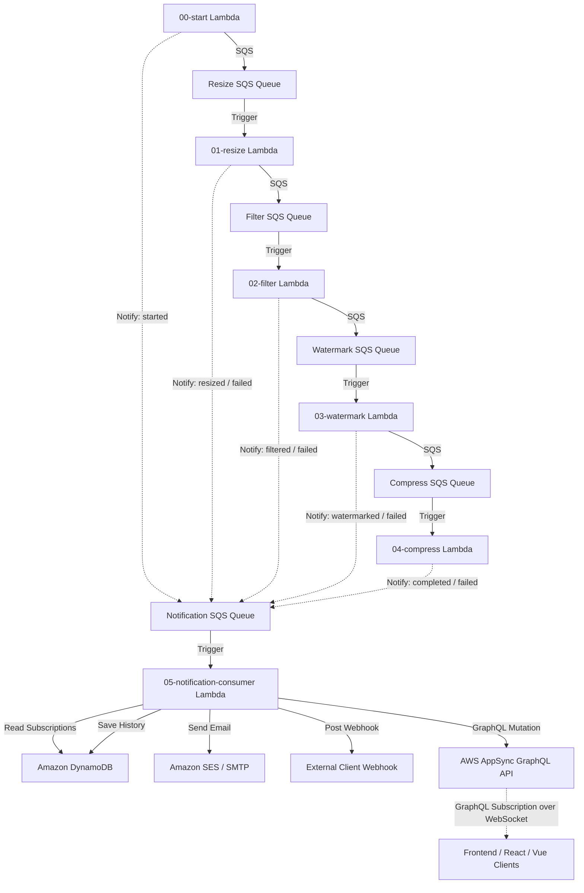

# Implementation Plan: Serverless Notification & Real-Time AppSync Integration

Refactor the notification logic from `notification-service` to run as a serverless Lambda consumer inside the `image-pipeline-app` stack. We will use AWS SQS triggers to invoke the consumer, Amazon DynamoDB for subscription and history storage, and AWS AppSync (GraphQL Subscriptions over WebSockets) to provide client-facing progress updates from A to Z.

## Serverless Notification Architecture

---

## Proposed Changes

We will implement this serverless notification stack within the existing [image-pipeline-app](file:///home/hungzazed/workspace/KienTruc/ImageProcessing/image-pipeline-app) directory.

### Central Serverless Configuration

#### [MODIFY] [serverless.yml](file:///home/hungzazed/workspace/KienTruc/ImageProcessing/image-pipeline-app/serverless.yml)

- Configure AWS AppSync resources (GraphQL API, Schema, NONE Data Source, Resolvers, API Key) in the CloudFormation `resources` section.
- Configure DynamoDB resources: `SubscriptionsTable` and `NotificationHistoryTable`.
- Add IAM policy statements for DynamoDB (Least Privilege: query, put, update) to the Lambda execution role.
- Expose AppSync credentials as environment variables (`APPSYNC_ENDPOINT`, `APPSYNC_API_KEY`).
- Add the `notificationConsumer` Lambda function to process events from SQS `NotificationQueue`.

### Lambda Notification Consumer

#### [NEW] [index.js](file:///home/hungzazed/workspace/KienTruc/ImageProcessing/image-pipeline-app/functions/05-notification-consumer/index.js) & [package.json](file:///home/hungzazed/workspace/KienTruc/ImageProcessing/image-pipeline-app/functions/05-notification-consumer/package.json)

Create SQS consumer Lambda:

- Triggered by `NotificationQueue`.
- For each message:
  - Extract the event data (`jobId`, `imageId`, `userId`, `eventType`, `metadata`).
  - Read matching subscriptions for the `userId` from DynamoDB `SubscriptionsTable`.
  - Dispatch notifications:
    - **Email**: Send via Amazon SES (or NodeMailer SMTP fallback).
    - **Webhook**: Send HTTP POST payload via `axios`.
  - Save log entry to DynamoDB `NotificationHistoryTable`.
  - Publish the event update to AppSync GraphQL API using a mutation request (`publishJobUpdate`) so that subscribed clients receive progress in real time.

### GraphQL API Definitions

#### [NEW] [schema.graphql](file:///home/hungzazed/workspace/KienTruc/ImageProcessing/image-pipeline-app/functions/05-notification-consumer/schema.graphql)

AppSync schema definition:

- `JobUpdate` Type: represents image processing progress.
- `publishJobUpdate` Mutation: triggered by the Lambda consumer.
- `onJobUpdate` Subscription: client WebSocket trigger subscribing to `jobId`.

---

## Verification Plan

### Security Verification

- **Least Privilege Access**: Ensure Lambda has access only to specific DynamoDB tables and SES, and S3 bucket.
- **TLS/SSL Encryption**: AppSync calls and database requests are encrypted in transit.
- **Input validation**: AppSync resolves GraphQL types strictly. SQS Consumer validates payload structure.

### Local & Integration Testing

- We can write mock events to trigger `notificationConsumer` locally.
- Verify DynamoDB queries and mutation publications.
- Test connection using a simple mock client subscribing to AWS AppSync.
