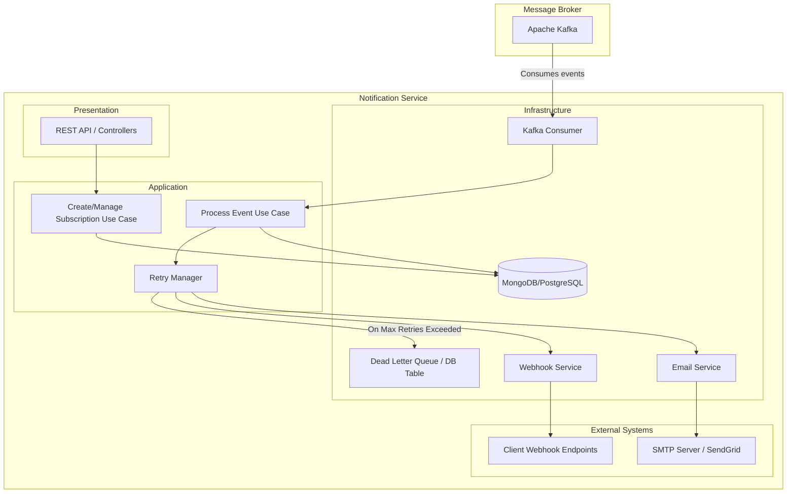

# Notification Service Architecture

## 1. Sơ đồ kiến trúc tổng quan

## 2. Giải thích các quyết định thiết kế quan trọng

### 2.1. Domain-Driven Design (DDD) / Clean Architecture
Kiến trúc được chia thành các layer rõ ràng:
- **Presentation (API)**: Cung cấp REST endpoints để các ứng dụng khác (hoặc admin) có thể CRUD các Subscription.
- **Application (Use Cases)**: Nơi chứa logic nghiệp vụ cốt lõi, điều phối giữa các services.
- **Domain (Entities/Interfaces)**: Chứa các cấu trúc dữ liệu cơ bản (Event schema, Subscription model) và các interfaces để đảo ngược sự phụ thuộc (Dependency Inversion).
- **Infrastructure**: Giao tiếp với thế giới bên ngoài (Kafka, Database, Email, Webhook).

### 2.2. Xử lý Retry và Dead Letter Queue (DLQ)
Khi gửi thông báo (đặc biệt là Webhook) bị lỗi, hệ thống sẽ sử dụng cơ chế **Exponential Backoff**:
- Lần 1: gửi ngay
- Lần 2: sau 2 giây
- Lần 3: sau 4 giây
Nếu vẫn thất bại sau số lần retry tối đa, notification sẽ được đẩy vào **Dead Letter Queue (DLQ)** để admin xem xét hoặc retry thủ công sau này.

### 2.3. Cơ sở dữ liệu
Lựa chọn **MongoDB** để lưu trữ:
- **Subscriptions**: Linh hoạt trong việc lưu các mảng events, metadata.
- **Notification History**: Ghi chép trạng thái gửi, timestamp và log lỗi. MongoDB rất phù hợp để log dạng event-driven data với schema linh hoạt.

### 2.4. Khả năng mở rộng (Scalability)
- Service có thể scale theo chiều ngang (horizontal scaling) nhờ việc sử dụng Kafka Consumer Group.
- Các container sẽ được quản lý qua Docker, giúp dễ dàng deploy lên Kubernetes hoặc ECS.
