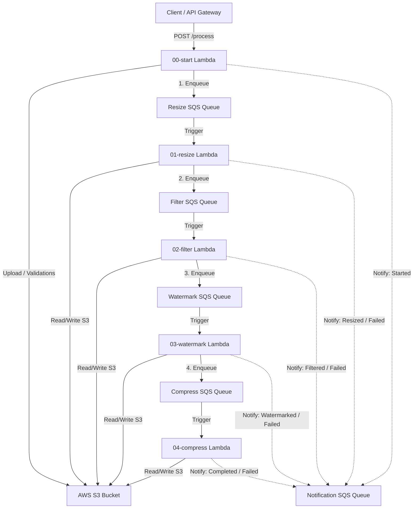

# Implementation Plan: Serverless Image Processing Pipeline

Refactor the stages of the existing `image-process-service` into decoupled AWS Lambda functions using the Serverless Framework. These functions will communicate sequentially through AWS SQS queues and store intermediate/final images in AWS S3. Execution status events will also be pushed to a dedicated notification queue.

## Architecture & Message Flow



### Event Payload Schema (SQS Pipeline Message)
This payload is passed from stage to stage:
```json
{
  "jobId": "uuid-string",
  "imageId": "uuid-string",
  "userId": "user-string",
  "s3Bucket": "bucket-name",
  "s3Key": "processed/jobId/stage-output.jpg",
  "options": {
    "resize": { "width": 800, "height": 600, "fit": "cover" },
    "filter": { "type": "sepia", "value": 1.2 },
    "watermark": { "type": "text", "text": "Confidential", "position": "bottom-right", "opacity": 0.5 },
    "compression": { "format": "png", "quality": 85 }
  },
  "metadata": {
    "width": 1920,
    "height": 1080,
    "format": "jpeg",
    "size": 204857
  },
  "logs": [
    { "stage": "InputStage", "status": "completed", "message": "Uploaded successfully", "timestamp": "2026-05-26T14:40:00Z" }
  ]
}
```

### Notification Event Schema (for Notification Service)
Pushed to `NotificationQueue` at each stage to match the `IEvent` entity format in the notification service:
```json
{
  "eventId": "uuid-string",
  "eventType": "image.processing.started | image.resized | image.filtered | image.watermarked | image.completed | image.failed",
  "timestamp": "2026-05-26T14:40:05Z",
  "source": "image-pipeline-app",
  "data": {
    "jobId": "job-uuid",
    "imageId": "image-uuid",
    "userId": "user-uuid",
    "metadata": {
      "width": 800,
      "height": 600,
      "format": "png"
    }
  }
}
```

---

## Proposed Changes

We will create a new folder `image-pipeline-app/` under the workspace root.

### Central Configuration

#### [NEW] [serverless.yml](file:///home/hungzazed/workspace/KienTruc/ImageProcessing/image-pipeline-app/serverless.yml)
Central definition of:
- Service name: `image-pipeline-app`
- Provider settings (AWS Node.js 20, region, IAM role statements for SQS and S3 least privilege).
- S3 Bucket (`image-pipeline-bucket`) and 5 SQS Queues (`ResizeQueue`, `FilterQueue`, `WatermarkQueue`, `CompressQueue`, `NotificationQueue`) in the resources section.
- Lambda functions:
  - `startPipeline` (HTTP trigger: POST `/process`)
  - `resize` (SQS trigger: `ResizeQueue`)
  - `filter` (SQS trigger: `FilterQueue`)
  - `watermark` (SQS trigger: `WatermarkQueue`)
  - `compress` (SQS trigger: `CompressQueue`)

#### [NEW] [.gitignore](file:///home/hungzazed/workspace/KienTruc/ImageProcessing/image-pipeline-app/.gitignore)
Standard Git ignore definitions for Node.js and Serverless (.serverless, node_modules, etc.).

#### [NEW] [deploy.yml](file:///home/hungzazed/workspace/KienTruc/ImageProcessing/image-pipeline-app/.github/workflows/deploy.yml)
GitHub Actions workflow file to build, run tests, and deploy using `serverless deploy` on pushes to the `main` branch.

### Common Utilities

#### [NEW] [logger.js](file:///home/hungzazed/workspace/KienTruc/ImageProcessing/image-pipeline-app/common/logger.js)
Simple structured logger helper formatting console logs for CloudWatch.

#### [NEW] [s3-helper.js](file:///home/hungzazed/workspace/KienTruc/ImageProcessing/image-pipeline-app/common/s3-helper.js)
Utilities to interact with AWS S3 using `@aws-sdk/client-s3`:
- `downloadFile(bucket, key, destLocalPath)`
- `uploadFile(bucket, key, srcLocalPath, contentType)`
- `uploadBuffer(bucket, key, buffer, contentType)`

### Lambda Functions

#### [NEW] [index.js](file:///home/hungzazed/workspace/KienTruc/ImageProcessing/image-pipeline-app/functions/00-start/index.js) & [package.json](file:///home/hungzazed/workspace/KienTruc/ImageProcessing/image-pipeline-app/functions/00-start/package.json)
Start handler:
- Accepts raw payload/request.
- Validates input formats (`s3Key`, `options`, `userId`).
- Sends the initial message to `ResizeQueue`.
- Sends a started event to `NotificationQueue`.
- Returns HTTP 200 with `jobId` and `imageId`.

#### [NEW] [index.js](file:///home/hungzazed/workspace/KienTruc/ImageProcessing/image-pipeline-app/functions/01-resize/index.js) & [package.json](file:///home/hungzazed/workspace/KienTruc/ImageProcessing/image-pipeline-app/functions/01-resize/package.json)
Resize stage:
- Checks `options.resize`. If missing, logs "skipped" and forwards SQS payload to `FilterQueue`.
- If present, downloads target image from S3, uses `sharp` to resize, uploads to S3, logs completion, and forwards message to `FilterQueue` and `NotificationQueue`.
- On error, catches and publishes `image.failed` to `NotificationQueue`.

#### [NEW] [index.js](file:///home/hungzazed/workspace/KienTruc/ImageProcessing/image-pipeline-app/functions/02-filter/index.js) & [package.json](file:///home/hungzazed/workspace/KienTruc/ImageProcessing/image-pipeline-app/functions/02-filter/package.json)
Filter stage:
- Checks `options.filter`. If missing, logs "skipped" and forwards SQS payload to `WatermarkQueue`.
- If present, downloads target image from S3, uses `sharp` to apply grayscale/sepia/blur/brightness, uploads to S3, logs completion, and forwards message to `WatermarkQueue` and `NotificationQueue`.
- On error, catches and publishes `image.failed` to `NotificationQueue`.

#### [NEW] [index.js](file:///home/hungzazed/workspace/KienTruc/ImageProcessing/image-pipeline-app/functions/03-watermark/index.js) & [package.json](file:///home/hungzazed/workspace/KienTruc/ImageProcessing/image-pipeline-app/functions/03-watermark/package.json)
Watermark stage:
- Checks `options.watermark`. If missing, logs "skipped" and forwards SQS payload to `CompressQueue`.
- If present, downloads target image from S3, adds text SVG overlay or downloads custom watermark image from S3 to overlay it, uploads result to S3, logs completion, and forwards to `CompressQueue` and `NotificationQueue`.
- On error, catches and publishes `image.failed` to `NotificationQueue`.

#### [NEW] [index.js](file:///home/hungzazed/workspace/KienTruc/ImageProcessing/image-pipeline-app/functions/04-compress/index.js) & [package.json](file:///home/hungzazed/workspace/KienTruc/ImageProcessing/image-pipeline-app/functions/04-compress/package.json)
Compress stage:
- Downloads target image from S3.
- Uses `sharp` to compress (quality control + jpeg/png/webp output conversion).
- Uploads final image to S3 (final destination).
- Logs completion, updates metadata size.
- Sends `image.completed` to `NotificationQueue`.
- On error, catches and publishes `image.failed` to `NotificationQueue`.

#### [NEW] [README.md](file:///home/hungzazed/workspace/KienTruc/ImageProcessing/image-pipeline-app/README.md)
Provides instructions for:
- Local testing using Serverless Offline or SQS emulation.
- Production deployment rules (including `sharp` binary packaging notes for AWS Lambda platform compatibility).
- A guide for updating the `notification-service` to read from AWS SQS instead of Kafka.

---

## Verification Plan

### Security Verification
- **Principle of Least Privilege**: Verify that IAM role permissions in `serverless.yml` restrict access only to the dedicated `image-pipeline-bucket` and the specific SQS queues.
- **Path Sanitization**: Ensure filenames downloaded into `/tmp` are sanitized using `path.basename()` to prevent directory traversal vulnerabilities.
- **Input Validation**: Check that inputs to the `start` function are thoroughly validated against expected patterns (e.g. S3 keys, numeric resize parameters).
- **Log Security**: Verify that logs do not print database connection credentials or PII (e.g. user details other than basic UUID).

### Local Offline Execution Testing
- We can write mock testing scripts in `scratch/` that load the handlers locally and run them against fake events to ensure functional correctness of each pipeline step.
- Verify message chains and final outputs.

### AWS Deployment & Execution Test
- Run `serverless deploy` (or dry-run package checks).
- Send a mock HTTP payload to the API Gateway endpoint and verify that files are successfully transformed on S3 and status events arrive on the `NotificationQueue`.
